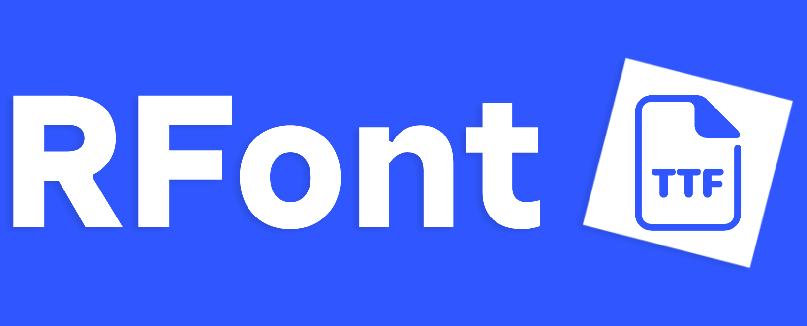

<div align="center">



### TrueType software rasterization in Roblox

**A from-scratch TrueType parser and software text renderer written in Luau.**


</div>

---

## 👋 About

RFont is an experimental **TrueType software rasterizer for Roblox**.

It loads raw `.ttf` font data, parses the TrueType structures directly in Luau, reconstructs glyph outlines, rasterizes them into a software framebuffer, and displays the result through `EditableImage`.

The rendered text does **not** use `FontFace` or `TextLabel`.

```text id="6xg8vc"
TTF
 │
 ▼
SFNT Tables
 │
 ├── cmap
 ├── head
 ├── hhea
 ├── hmtx
 ├── maxp
 ├── loca
 ├── glyf
 └── kern
 │
 ▼
Unicode → Glyph Mapping
 │
 ▼
TrueType Glyph Outlines
 │
 ▼
Quadratic Bézier Flattening
 │
 ▼
Supersampled Scanline Rasterization
 │
 ▼
Glyph Cache
 │
 ▼
Kerning + Layout
 │
 ▼
RGBA Framebuffer
 │
 ▼
EditableImage
```

## ✨ Features

* TrueType `.ttf` parsing directly in Luau
* `cmap` format 4 support
* `cmap` format 12 support
* Unicode codepoint lookup
* Simple glyph decoding
* Composite glyph decoding
* Composite scale, XY scale, and 2x2 transforms
* TrueType quadratic outline support
* Automatic implied on-curve point handling
* Quadratic Bézier flattening
* Software scanline rasterization
* Configurable supersampling
* Anti-aliased glyph output
* Glyph raster cache
* Horizontal font metrics
* Legacy `kern` format 0 kerning
* Software RGBA framebuffer
* Alpha blending
* `EditableImage` output
* Zstd-compressed font storage
* Base64 chunked font data
* Roblox Studio TTF importer plugin

## 🧠 How It Works

### 1. Import

The included Studio plugin lets you select a `.ttf` file from disk.

The font is:

```text id="sb6750"
Raw TTF
  ↓
Zstd Compression
  ↓
48 KiB Chunks
  ↓
Base64 Encoding
  ↓
ReplicatedStorage/RFontFonts/<Font>/Data
```

Imported fonts are stored under:

```text id="6wr1g0"
ReplicatedStorage
└── RFontFonts
    └── YourFont
        └── Data
            ├── 000001
            ├── 000002
            ├── 000003
            └── ...
```

Each imported font also stores metadata such as:

```text id="gbit1o"
Format
RawByteLength
CompressedByteLength
ChunkCount
```

### 2. Load

At runtime, RFont:

1. Finds the requested imported font
2. Reads each Base64 chunk
3. Decodes the chunks
4. Reconstructs the compressed buffer
5. Zstd-decompresses the original TTF
6. Parses the font directly from memory

### 3. Parse

RFont reads the SFNT table directory and uses the following TrueType tables:

```text id="v1hs6q"
head    Font header
hhea    Horizontal header
maxp    Maximum profile
hmtx    Horizontal metrics
loca    Glyph locations
glyf    Glyph outline data
cmap    Unicode character mapping
kern    Optional kerning data
```

TrueType values are stored big-endian, so RFont includes its own integer readers for parsing the binary font data.

### 4. Character Mapping

Unicode codepoints are mapped to glyph IDs through the font's `cmap` table.

RFont supports:

```text id="fjb0pg"
cmap format 4     BMP character mapping
cmap format 12    Full Unicode character mapping
```

Format 12 groups are searched using binary search.

### 5. Glyph Decoding

RFont reads glyph offsets through the `loca` table and parses outlines from `glyf`.

Both simple and composite glyphs are supported.

Composite glyph components can apply:

```text id="d6ng3j"
Translation
Uniform Scale
Independent X/Y Scale
2x2 Transform Matrix
```

Composite recursion is limited to prevent malformed fonts from causing infinite nesting.

### 6. Quadratic Curves

TrueType glyphs use quadratic Bézier curves.

RFont reconstructs contour points, inserts implied on-curve points where required, and converts each curve into line segments.

```text id="2j9m58"
P0 ───── P1 ───── P2
      control

B(t) = (1-t)²P0 + 2(1-t)tP1 + t²P2
```

The number of generated segments adapts based on the size of the curve.

### 7. Rasterization

Glyph outlines are rasterized entirely in software.

For every scanline, RFont:

1. Finds intersections between the scanline and glyph edges
2. Sorts intersection points
3. Fills alternating spans
4. Rasterizes into a supersampled temporary buffer
5. Downsamples coverage into an 8-bit alpha mask

The default renderer uses:

```text id="9r93py"
Supersampling    3x
Canvas           1024 × 420
Default Size     84 px
```

### 8. Glyph Cache

Rasterized glyphs are cached using:

```text id="lbc5xh"
Glyph ID
Font Size
Supersampling Level
```

Repeated characters can reuse previously generated alpha masks instead of being rasterized again.

### 9. Text Layout

RFont performs text layout using:

* Horizontal advance metrics
* Glyph bearings
* Font units-per-em
* Font scaling
* Kerning pairs
* Unicode glyph lookup

The included demo centers each rendered string based on its measured width.

### 10. Framebuffer

Every glyph is blended into a software RGBA framebuffer.

```text id="fmh978"
Glyph Alpha
    ↓
Software Alpha Blend
    ↓
RGBA Framebuffer
    ↓
EditableImage:WritePixelsBuffer()
```

The resulting framebuffer is uploaded to an `EditableImage` and displayed through an `ImageLabel`.

## 📦 Installation

### Clone

```bash id="kek2jo"
git clone https://github.com/runtimelul/RFont.git
cd RFont
```

### Studio Plugin

Install:

```text id="fvl4cf"
RFont_TTF_Importer.plugin.lua
```

as a local Roblox Studio plugin.

The plugin adds an **RFont** toolbar with an **Import TTF** button.

Click it and select a TrueType font.

RFont will automatically create:

```text id="9wtfam"
ReplicatedStorage
└── RFontFonts
```

and store the compressed font there.

### Renderer

Add:

```text id="uv5ilj"
RFont.client.lua
```

as a client-side script in your experience.

Run the experience after importing at least one compatible font.

If `FONT_NAME` is left as `nil`, RFont selects the first imported TTF alphabetically.

To explicitly choose a font:

```lua id="son53o"
local FONT_NAME = "Your_Font_Name"
```

You can also configure:

```lua id="06f5ll"
local W, H = 1024, 420
local FONT_SIZE = 84
local OVERSAMPLE = 3
local DEFAULT_TEXT = "RFont — TrueType in Luau"
```

## 📁 Repository Structure

```text id="7o0x77"
RFont/
├── logo.png
├── README.md
├── LICENSE
├── RFont.client.lua
└── RFont_TTF_Importer.plugin.lua
```

## ⚠️ Font Compatibility

RFont v1 currently targets TrueType fonts using `glyf` outlines.

### Supported

```text id="vhoxvh"
TrueType SFNT
glyf outlines
loca format 0
loca format 1
cmap format 4
cmap format 12
Simple glyphs
Composite glyphs
kern format 0
```

### Not Supported

```text id="04fw5c"
CFF outlines
CFF2 outlines
OTTO/CFF OpenType fonts
Native TrueType hinting
Full OpenType shaping
GPOS kerning
GSUB substitutions
Variable fonts
Complex-script shaping
```

The importer rejects `OTTO` fonts and fonts without a `glyf` table.

## 🔬 Technical Notes

RFont is intentionally a software implementation.

It does not attempt to replace Roblox's normal text system for typical UI. The project exists primarily as an experiment in:

* Font parsing
* Binary formats
* Rasterization
* Bézier geometry
* Text layout
* Graphics programming
* Software rendering
* Luau performance
* Roblox engine experimentation

## 🚧 Status

RFont is an experimental v1 release.

The current goal is to keep the implementation understandable and relatively compact while demonstrating that complete TrueType outline rasterization can be implemented directly inside Roblox.

Bug reports, compatibility tests, and improvements are welcome.

## 🤝 Contributing

Pull requests and issues are welcome.

## 📄 License

RFont is available under the **MIT License**.

See [`LICENSE`](LICENSE).

---

<div align="center">


**TrueType software rasterization in Luau**

Built by [@runtimelul](https://github.com/runtimelul)

`TTF` · `Luau` · `Software Rendering` · `Roblox`

</div>
